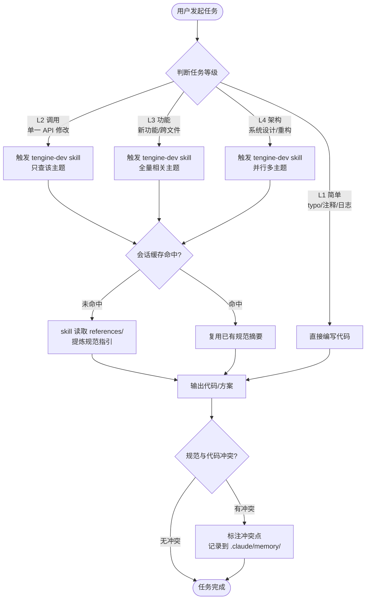
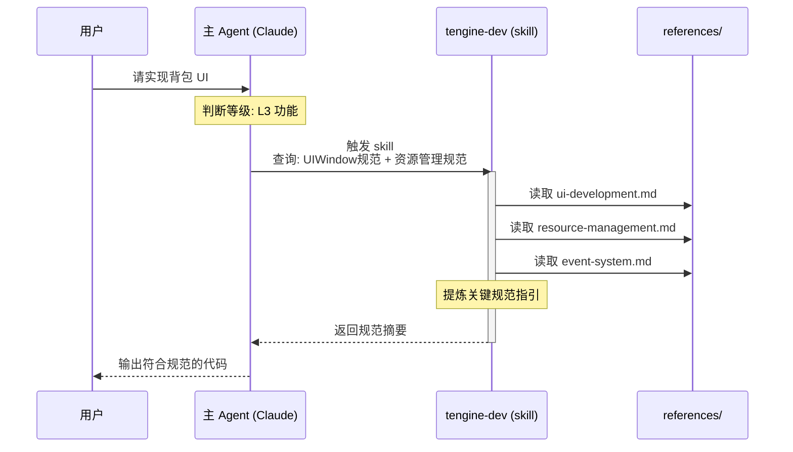
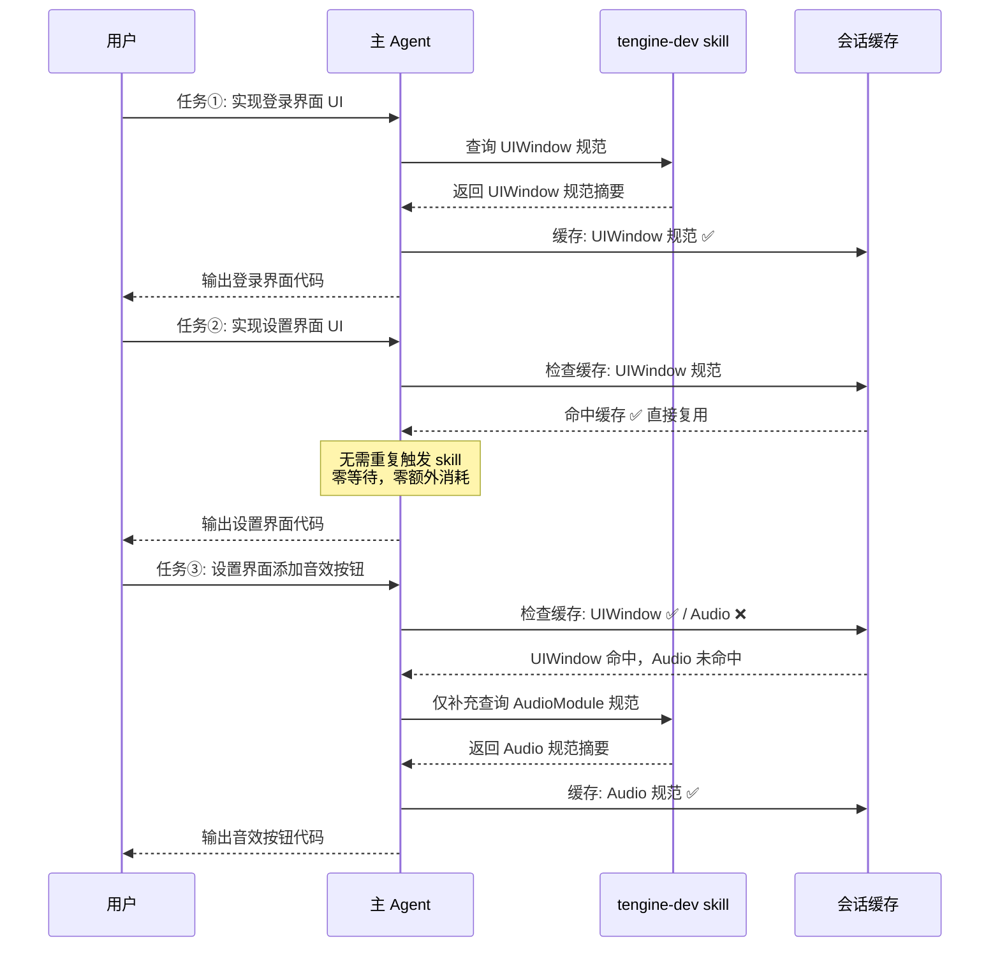
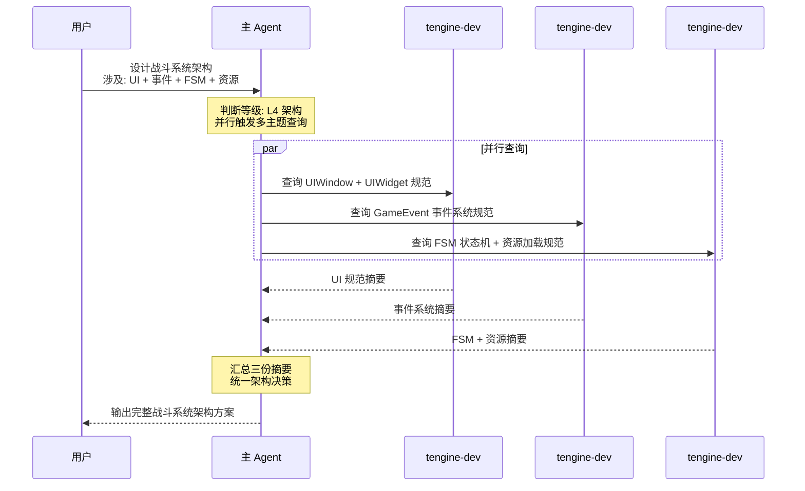
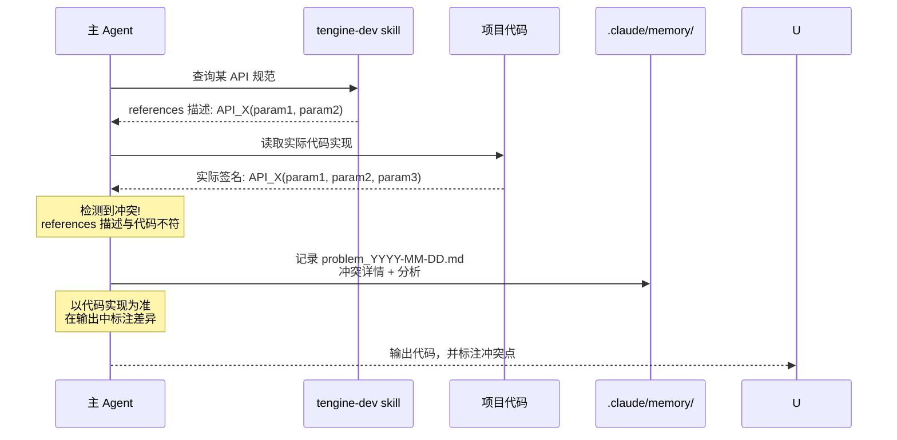
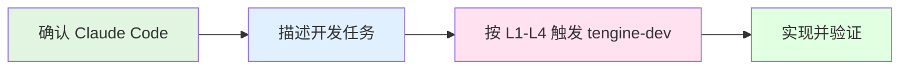
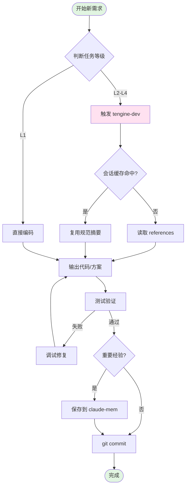
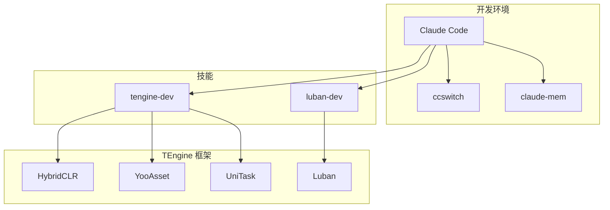

# AI 开发工作流指南

> 本文档介绍 TEngine 项目完整的 AI 辅助开发工作流，包含 tengine-dev skill 按需查询架构、任务等级分级机制与会话缓存策略。

**更新时间**: 2026-08-26

---

## 前提条件

### 必需工具

在开始使用 TEngine AI 开发工作流之前，请确保已安装以下工具：

#### 1. Claude (claude.ai/code)

**推荐使用 Claude Code** 作为主要的 AI 编程助手：

- 官方地址：[https://claude.ai/code](https://claude.ai/code)
- 支持本地文件操作、代码编辑
- 集成 tengine-dev 等技能
- 提供上下文感知的 TEngine 开发指导

**安装方法**:
```bash
# 通过官网下载并安装
# Windows: https://claude.ai/code/download
# 安装后登录 Anthropic 账号即可使用
```

#### 2. ccswitch（API 密钥管理和反代）

**ccswitch** 是一个强大的 Claude API 管理工具，支持：
- 多个 API 密钥管理
- 反向代理配置
- 自动切换和负载均衡

#### 3. claude-mem（长期记忆库）★ 强烈推荐

**claude-mem** 是 Claude 的向量数据库插件，提供跨会话的长期记忆能力：

- **向量数据库**: 自动存储项目知识和历史经验
- **智能搜索**: 快速查找过去的解决方案
- **知识积累**: 越用越智能，持续学习项目特性
- **无缝集成**: 自动在 Claude Code 中启用

**安装方法**:
```bash
/plugin marketplace add thedotmack/claude-mem
/plugin install claude-mem
```

**安装完后自动会启用**

---

## 目录

- [前提条件](#前提条件)
- [概述](#概述)
- [tengine-dev Skill 工作流](#tengine-dev-skill-工作流)
- [快速开始](#快速开始)
- [tengine-dev Skills](#tengine-dev-skills)
- [集成工作流](#集成工作流)
- [最佳实践](#最佳实践)
- [工具链总览](#工具链总览)
- [相关文档](#相关文档)
- [常见问题](#常见问题)
- [进阶使用](#进阶使用)

---

## 概述

TEngine 项目提供了一套完整的 AI 辅助开发工作流，由以下核心组件构成：

- **tengine-dev skill**: Claude Code 专用 TEngine 开发技能，从 `references/` 按需提供精炼规范
- **任务等级分级（L1-L4）**: 按任务复杂度决定查询深度，简单任务零开销
- **会话内缓存**: 同一主题在同一会话中只查询一次，后续任务复用
- **冲突标注**: 主动检测 references 与代码冲突，标注后以代码实现为准

---

## tengine-dev Skill 工作流

### 整体流程总览



---

### 时序图一：规范获取流程

> **核心优势**：tengine-dev skill 直接从精炼的 `references/` 文档提取规范，无多余上下文噪声。



---

### 时序图二：会话内缓存机制

> **核心优势**：同一会话中相同主题只查询一次，后续任务直接复用，避免重复消耗。



---

### 时序图三：并行多主题查询（L4 架构任务）

> **核心优势**：架构级任务并行查询多个主题，汇总后统一决策，大幅减少串行等待。



---

### 时序图四：规范冲突处理

> **核心优势**：AI 主动检测 references 与代码的不一致，标注冲突并记录，以代码实现为最终依据。



---

### 任务等级分级说明

| 等级 | 判断标准 | 知识查询策略 |
|------|---------|-------------|
| **L1 简单** | typo 修正、注释修改、日志输出、单行变量改名（前提：不涉及框架 API 名称、UI 节点前缀、事件定义或资源路径） | ❌ 跳过查询，直接编码 |
| **L2 调用** | 调用已知 API、单一模块的局部修改 | ✅ 触发 `tengine-dev` skill（只查该主题） |
| **L3 功能** | 新功能开发、跨文件修改、新增 UI/资源/事件逻辑 | ✅ 触发 `tengine-dev` skill（全量相关主题） |
| **L4 架构** | 模块设计、系统重构、多模块协作、架构决策 | ✅ 触发 `tengine-dev` skill（并行多主题） |

> **判断原则**：宁可高估等级，不可低估——不确定时上调一级。

### 工作流快速参考

```
┌─────────────────────────────────────────────────────────┐
│                   TEngine AI 工作流                      │
├─────────────────────────────────────────────────────────┤
│  Step 0  判断任务等级 L1/L2/L3/L4                        │
│  Step 1  L1 直接编码                                     │
│         L2-L4 触发 tengine-dev skill 获取规范            │
│         （会话内缓存命中则直接复用，无需重复触发）        │
│  Step 2  基于规范输出代码/方案                            │
│  Step 3  若规范与代码冲突，标注冲突，记录到 .claude/memory/│
└─────────────────────────────────────────────────────────┘
```

详细规范请参考：[CLAUDE.md](../UnityProject/CLAUDE.md)

---

---

## 快速开始

### 5 分钟上手 TEngine AI 开发



#### 第一步：确认环境

确保已安装 Claude Code，并打开本仓库的 `UnityProject` 目录。项目内已包含 `tengine-dev` skill（`.claude/skills` / `.codex/skills`）。

#### 第二步：描述任务

直接用自然语言描述需求，例如：

```
帮我创建一个背包 UIWindow，异步加载道具图标，关闭时释放资源。
```

Claude 会：
1. 判断任务等级（通常为 L3）
2. 触发 `tengine-dev` 查询 UI / 资源相关规范
3. 输出符合 TEngine 规范的代码

#### 第三步：验证与提交

在 Unity 中验证功能后提交代码：

```bash
git add .
git commit -m "feat: add inventory UI"
```

### 常见场景速查

| 场景 | 做法 |
|------|------|
| typo / 注释 / 日志 | L1，直接改，不触发 skill |
| 调用已知 API | L2，触发 tengine-dev 查该主题 |
| 新 UI / 跨文件功能 | L3，全量相关主题 |
| 系统架构 / 重构 | L4，并行多主题 |
| 配置表增删改 | 使用 `luban-dev` skill |

---

## tengine-dev Skills

### 什么是 tengine-dev？

`tengine-dev` 是 Claude Code 的技能，专门用于 TEngine 框架开发指导。

### 触发条件

在 TEngine 项目中编写或修改代码时，以下关键词会触发 tengine-dev 技能：

- **模块系统**: ResourceModule, AudioModule, TimerModule, GameModule
- **UI 开发**: UIWindow, UIWidget, UIModule
- **事件系统**: GameEvent, EventInterface, AddUIEvent
- **资源管理**: YooAsset, LoadAssetAsync, UnloadAsset
- **热更代码**: HybridCLR, GameApp, HotFix
- **配置表**: Luban, ConfigSystem

### 核心原则

1. **异步优先**: IO 操作用 `UniTask`，禁止同步加载/Coroutine
2. **模块访问**: 通过 `GameModule.XXX` 访问
3. **资源必须释放**: `LoadAssetAsync` 对应 `UnloadAsset`
4. **热更边界**: `GameScripts/Main` 不热更，`GameScripts/HotFix/` 全部热更
5. **事件解耦**: 模块间用 `GameEvent`，UI 内部用 `AddUIEvent`

### 程序集分层

```
GameScripts/Main/       → 主包（不热更）
GameScripts/HotFix/
  ├── GameProto/        → Luban 配置代码
  └── GameLogic/        → 业务逻辑（GameApp.cs 入口）
```

### 其他 Skills

#### luban-dev

Luban 游戏配置全栈工具，支持枚举/Bean/数据表的增删改查、代码生成、TEngine 集成。

**触发场景**：
- 编辑游戏配置数据（配置表/数据表/道具表/技能表/奖励表/活动表）
- 新增/修改/删除配置表结构
- 定义枚举/Bean/字段
- 导表/生成配置代码
- 编写 luban.conf 或 Schema 定义
- Luban 类型系统/校验器问题

> 即使用户未明确说"Luban"，只要是编辑游戏配置数据，也应使用此技能。

#### wiki-synchelper

Wiki 同步助手，用于"项目实现内容"与"开发 Wiki 文档"之间的双向同步，确保 AI 可基于 Wiki 快速理解项目现状并按规范继续开发。

**触发场景**：
- 用户要求扫描/比对/同步/报告项目与 Wiki 的差异
- 代码实现已更新但 Wiki 文档未跟进
- Wiki 文档需要反向修正代码结构
- 用户说"同步 Wiki"、"更新文档"、"Wiki 和代码不一致"、"扫描文档差异"

---

## 集成工作流

### 完整开发流程图



### 详细流程说明

#### 阶段 1: 明确需求

用自然语言描述目标、约束与验收标准。需求模糊时先让 AI 梳理方案与边界，再动手编码。

#### 阶段 2: 按等级获取规范

- L1：直接改代码
- L2–L4：触发 `tengine-dev`，按主题读取 `references/`
- 同一会话复用已查过的主题摘要

#### 阶段 3: 实现与验证

遵循 TEngine 核心原则编写代码，在 Unity 中验证功能。若规范与代码冲突，以代码为准并记录到 `.claude/memory/`。

#### 阶段 4: 记忆保存（可选）

重要经验可由 claude-mem 自动保存，便于后续跨会话检索。

### 不同场景的工作流

#### 场景 1: 新功能开发

描述功能 → 触发 tengine-dev（L3/L4）→ 实现 → Unity 验证 → 提交

#### 场景 2: Bug 修复

描述现象与复现路径 → 定位代码 → 按规范修复 → 验证 → 提交

#### 场景 3: 重构优化

先分析现状与约束 → L4 并行查询相关规范 → 渐进式重构并对比验证

### 与 Claude Code 配合的最佳实践

#### 1. 利用技能自动触发

**无需手动调用技能**，只需在描述中包含关键词：

```
❌ 不好：请使用 tengine-dev 技能帮我创建一个 UIWindow
✅ 好的：帮我创建一个背包 UIWindow，需要加载道具图标资源
→ 自动触发 tengine-dev，提供 UIWindow、资源管理指导
```

#### 2. 分阶段处理复杂任务

将大需求拆成可验证的小步骤（UI 框架 → 数据逻辑 → 网络同步），每阶段独立验证后再继续。

#### 3. 充分利用 claude-mem

```
"上次我们是怎么处理 UI 资源释放的？"
→ 触发 claude-mem:mem-search，查找历史经验
```

---

## 最佳实践

### 1. 需求定义

编写清晰的场景驱动描述：

```markdown
## 场景 1: 用户打开背包

**前置条件**:
- 用户已登录
- 拥有至少 1 个道具

**操作流程**:
1. 点击主界面的背包按钮
2. 异步加载背包 UI Prefab
3. 从服务器获取道具列表
4. 渲染道具图标（异步加载）

**预期结果**:
- 背包界面在 1 秒内打开
- 所有道具图标正确显示
- 支持滚动查看更多道具

**异常情况**:
- 网络超时：显示错误提示
- 资源加载失败：使用默认图标
```

### 2. 代码规范

在每次开发完成后，确认：

- [ ] **异步优先**: 所有 IO 操作使用 `UniTask`
- [ ] **资源释放**: 每个 `LoadAssetAsync` 都有对应的 `UnloadAsset`
- [ ] **模块访问**: 通过 `GameModule.XXX` 访问
- [ ] **热更边界**: 业务代码放在 `GameScripts/HotFix/`
- [ ] **事件解耦**: 模块间用 `GameEvent`，UI 内用 `AddUIEvent`

### 3. 文档维护

发现新的最佳实践时告诉 Claude 记住，或写入 `tengine-dev/references/` / `troubleshooting.md`。

### 4. 团队协作

- 统一遵循 CLAUDE.md 中的 L1–L4 工作流
- PR 前自检：符合规范、Unity 已测、重要约定已记录

### 5. 调试技巧

把文件路径与现象一并告诉 Claude；可用 claude-mem 检索历史同类问题。

### 6. 性能优化建议

优先批量预加载（`UniTask.WhenAll`）与对象池，避免逐个同步加载。

### 7. 安全注意事项

用 `List<AssetHandle>` 统一管理资源并在销毁时释放；提交前检查热更目录边界。

---

## 工具链总览

### 完整技术栈



### 工具职责说明

| 工具 | 职责 | 使用场景 |
|------|------|----------|
| **Claude Code** | AI 编程助手核心 | 所有开发场景 |
| **ccswitch** | API 管理和反代 | 密钥管理、访问加速 |
| **claude-mem** | 长期记忆库 | 知识积累、历史查询 |
| **tengine-dev** | TEngine 开发指导 | 代码开发、规范检查 |
| **luban-dev** | 配置表全栈工具 | 配置结构与数据编辑 |

---

## 相关文档

- [TEngine 框架文档](Books/0-介绍.md)
- [tengine-dev 技能参考](../UnityProject/.claude/skills/tengine-dev/references/)
- [CLAUDE.md 强制工作流](../UnityProject/CLAUDE.md)
- [claude-mem 插件](https://github.com/thedotmack/claude-mem)

---

## 常见问题

### Q: 为什么需要 ccswitch？

A: 多密钥管理、反向代理加速、降低单密钥限流影响。

### Q: claude-mem 的记忆会占用很多空间吗？

A: 一般不会。只保存关键经验，并支持去重与保留策略。

### Q: tengine-dev 技能如何触发？

A: 自动触发。描述中包含 UIWindow、GameModule、YooAsset、UniTask 等关键词即可。

### Q: 如何验证环境配置正确？

A:
```bash
# 在 Claude Code 中测试
"请帮我创建一个简单的 UIWindow"
→ 应该自动触发 tengine-dev 技能

# 测试 claude-mem（若已安装）
"上次我们是怎么处理资源加载的？"
→ 应该能搜索到历史记忆
```

---

## 进阶使用

### 扩展 tengine-dev 技能

在 `UnityProject/.claude/skills/tengine-dev/references/` 中添加自定义参考文档：

```bash
# 添加项目特定的最佳实践
touch UnityProject/.claude/skills/tengine-dev/references/custom-patterns.md
```

同步时请同步更新 `.codex/skills/tengine-dev/references/`（若使用 Codex）。
