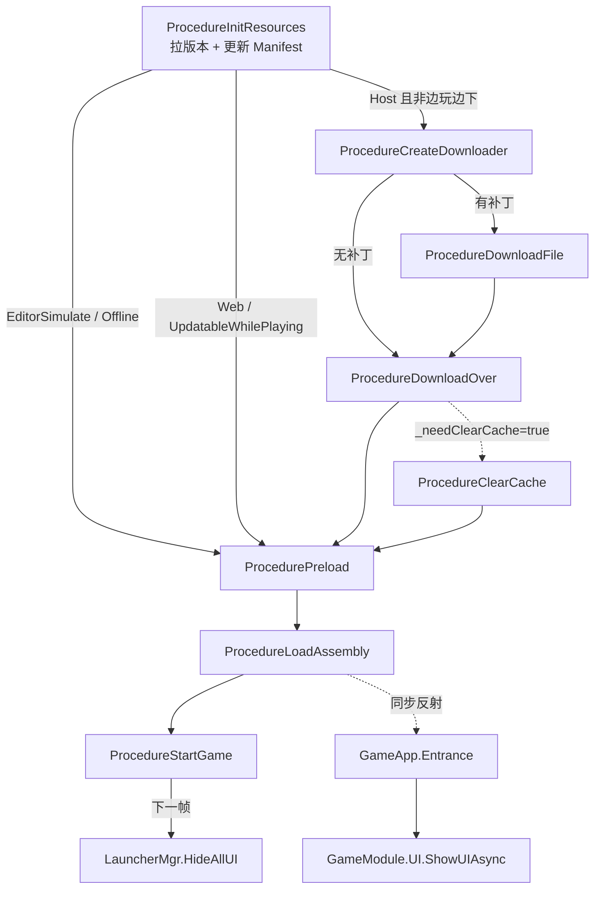

# Procedure 启动流程详解

> TEngine 项目内 Procedure 系统的完整拆解。  
> 基于仓库实际代码整理（2026-08-27）。  
> 相关代码：`UnityProject/Assets/GameScripts/Procedure/`、`UnityProject/Assets/TEngine/Runtime/Module/ProcedureModule/`

---

## 一句话定义

**Procedure = 用 FSM（有限状态机）实现的「游戏启动大流程」。**

每个 `ProcedureXxx` 是一个状态；`ChangeState<T>()` 就是切换到下一个状态。

---

## 一、Procedure 在框架里是什么

### 1.1 三层继承关系

```
FsmState<IProcedureModule>          ← 通用 FSM 状态基类
        ↑
TEngine.ProcedureBase               ← 框架层 Procedure 基类
        ↑
Procedure.ProcedureBase             ← 项目层，加了 UseNativeDialog + _resourceModule
        ↑
ProcedureLaunch / Splash / ...      ← 11 个具体流程
```

项目里的 `ProcedureBase`（`GameScripts/Procedure/ProcedureBase.cs`）额外做了两件事：

- 所有 Procedure 都能直接用 `_resourceModule`
- `UseNativeDialog`：资源更新阶段是否允许用原生对话框（更新完成前通常 `true`）

```csharp
public abstract class ProcedureBase : TEngine.ProcedureBase
{
    public abstract bool UseNativeDialog { get; }
    protected readonly IResourceModule _resourceModule = ModuleSystem.GetModule<IResourceModule>();
}
```

### 1.2 ProcedureModule：Procedure 的管理器

`ProcedureModule` 本身不跑业务逻辑，它只是 **把 11 个 Procedure 装进一台 FSM**：

```csharp
public void Initialize(IFsmModule fsmModule, params ProcedureBase[] procedures)
{
    _fsmModule = fsmModule;
    _procedureFsm = _fsmModule.CreateFsm(this, procedures);
}
```

- **Owner（持有者）**：`IProcedureModule` 自己
- **State（状态）**：各个 `ProcedureXxx`
- **CurrentProcedure**：当前在哪个 Procedure

### 1.3 谁驱动 Procedure 每帧跑？

```
RootModule.Update()
  → ModuleSystem.Update()
    → FsmModule 更新 Procedure 这台 FSM
      → 当前 Procedure 的 OnUpdate()
```

不是 `GameEntry` 在驱动，是 **RootModule 每帧** 在驱动。

---

## 二、Procedure 怎么被启动

### 2.1 配置：`ProcedureSetting.asset`

路径：`UnityProject/Assets/TEngine/Settings/ProcedureSetting.asset`

```yaml
availableProcedureTypeNames:  # 注册 11 个 Procedure（顺序不重要）
  - Procedure.ProcedureClearCache
  - Procedure.ProcedureCreateDownloader
  - Procedure.ProcedureDownloadFile
  - Procedure.ProcedureDownloadOver
  - Procedure.ProcedureInitPackage
  - Procedure.ProcedureInitResources
  - Procedure.ProcedureLaunch
  - Procedure.ProcedureLoadAssembly
  - Procedure.ProcedurePreload
  - Procedure.ProcedureSplash
  - Procedure.ProcedureStartGame
entranceProcedureTypeName: Procedure.ProcedureLaunch  # 入口
```

**注意**：asset 里的列表顺序 ≠ 运行顺序。运行顺序由各 Procedure 里的 `ChangeState` 决定。

### 2.2 启动代码

`GameEntry.Awake()` → `Settings.ProcedureSetting.StartProcedure()`：

1. 反射创建 11 个 Procedure 实例
2. `ProcedureModule.Initialize(FsmModule, procedures)`
3. `StartProcedure(ProcedureLaunch)` — 进入第一个状态

---

## 三、每个 Procedure 的生命周期

每个状态都有 5 个回调（来自 `FsmState`）：

| 回调 | 何时调用 | 典型用途 |
|------|----------|----------|
| `OnInit` | FSM 创建时，**只一次** | 缓存模块引用、初始化回调对象 |
| `OnEnter` | **进入该状态** | 开始异步任务、显示 UI |
| `OnUpdate` | **每帧**（当前状态） | 检查完成标志、切下一个状态 |
| `OnLeave` | **离开该状态** | 清理（本项目用得少） |
| `OnDestroy` | FSM 销毁 | 释放（本项目用得少） |

**切状态的写法**：

```csharp
ChangeState<ProcedureSplash>(procedureOwner);
```

`procedureOwner` 就是 `IFsm<IProcedureModule>`，传进去给基类 `ChangeState` 用。

---

## 四、完整流程图（按 PlayMode 分叉）

### 4.1 公共前半段（所有模式都走）

```
ProcedureLaunch
    │  OnEnter: LauncherMgr.Initialize + 语言/音量
    │  OnUpdate: 第一帧 →
    ▼
ProcedureSplash
    │  OnUpdate: 第一帧 →（闪屏动画占位，当前直接跳）
    ▼
ProcedureInitPackage
    │  OnEnter: async InitPackage()
    │  成功 →
    ▼
ProcedureInitResources
```

### 4.2 后半段分叉



### 4.3 Editor 模拟模式（日常开发）

```
Launch → Splash → InitPackage → InitResources → Preload → LoadAssembly → StartGame
```

**不会走**：CreateDownloader / DownloadFile / DownloadOver / ClearCache

---

## 五、11 个 Procedure 逐个拆解

---

### ① ProcedureLaunch — 启动器

**文件**：`GameScripts/Procedure/ProcedureLaunch.cs`  
**职责**：游戏启动后的「环境初始化」

| 时机 | 做什么 |
|------|--------|
| `OnInit` | 拿 `IAudioModule` |
| `OnEnter` | `LauncherMgr.Initialize()`（找 UIRoot/UICanvas）<br>读 PlayerPrefs 恢复语言、音量 |
| `OnUpdate` | **第一帧**就 `ChangeState<ProcedureSplash>` |

**要点**：

- 此时 YooAsset 还没 Init，资源系统未就绪
- 只做 **Launcher 层 + 本地化/音频设置**
- 语言不支持时 fallback 到 English

---

### ② ProcedureSplash — 闪屏

**文件**：`GameScripts/Procedure/ProcedureSplash.cs`  
**职责**：品牌 Logo / 闪屏动画（当前是占位）

| 时机 | 做什么 |
|------|--------|
| `OnUpdate` | **第一帧**就 `ChangeState<ProcedureInitPackage>` |

**要点**：

- `//Splash.Active(splashTime:3f);` 被注释了，所以现在 **0 帧停留**
- 以后要加闪屏，在这里做延迟再 ChangeState

---

### ③ ProcedureInitPackage — 初始化 YooAsset Package

**文件**：`GameScripts/Procedure/ProcedureInitPackage.cs`  
**职责**：让 YooAsset 资源系统跑起来

| 时机 | 做什么 |
|------|--------|
| `OnEnter` | `InitPackage(procedureOwner).Forget()` 异步执行 |
| async | `_resourceModule.InitPackage(DefaultPackageName)` |
| 成功 | 按 PlayMode 分支：<br>• EditorSimulate / Offline → InitResources<br>• Host / Web → 显示 LoadUpdateUI → InitResources |
| 失败 | 弹 MessageBox，点确认重试或退出 |

**要点**：

- 这是 **YooAsset 第一次真正初始化**
- Host/Web 模式这里会第一次弹出 **LoadUpdateUI**（进度条 UI）
- `LoadText.Instance.InitConfigData(null)` 初始化热更阶段文案

---

### ④ ProcedureInitResources — 更新资源清单

**文件**：`GameScripts/Procedure/ProcedureInitResources.cs`  
**职责**：向服务器（或本地）拿 **版本号 + Manifest（资源清单）**

| 时机 | 做什么 |
|------|--------|
| `OnEnter` | 显示「初始化资源中...」<br>`StartCoroutine(InitResources)` |
| Coroutine 步骤 | 1. `RequestPackageVersionAsync()` 拿版本<br>2. `UpdatePackageManifestAsync(version)` 更新清单<br>3. `_initResourcesComplete = true` |
| `OnUpdate` | 等 `_initResourcesComplete`，然后分叉 |

**OnUpdate 分叉逻辑**：

```
_initResourcesComplete == false  → 继续等

Host / Web 模式：
  WebPlayMode 或 UpdatableWhilePlaying → Preload（边玩边下，跳过下载）
  否则 → CreateDownloader（检查要不要下补丁）

EditorSimulate / Offline → Preload
```

**错误处理**：

- Host 模式网络失败 → 看 `UpdateSetting.UpdateStyle` 是强制还是可选
- 可选更新 + 无网络 → 用本地缓存版本直接进 Preload

**要点**：

- 这里 **还没下载资源文件**，只是更新了「该有哪些文件、版本是多少」
- 清单更新完才知道要不要走下载链

---

### ⑤ ProcedureCreateDownloader — 创建下载器

**文件**：`GameScripts/Procedure/ProcedureCreateDownloader.cs`  
**职责**：对比本地和远程，看 **有没有补丁要下**

| 时机 | 做什么 |
|------|--------|
| `OnEnter` | `CreateDownloader().Forget()` |
| async | `_resourceModule.CreateResourceDownloader()` |
| `TotalDownloadCount == 0` | 没补丁 → **直接** `ChangeState<ProcedureDownloadOver>` |
| 有补丁 | 弹 MessageBox：「发现 N 个文件，共 X MB，是否下载？」<br>确认 → DownloadFile<br>取消 → Quit |

**要点**：

- **用户确认点**在这里 — 不是自动下载
- 只有 Host 模式且非边玩边下才会走到这

---

### ⑥ ProcedureDownloadFile — 下载补丁

**文件**：`GameScripts/Procedure/ProcedureDownloadFile.cs`  
**职责**：真正下载差异资源

| 时机 | 做什么 |
|------|--------|
| `OnEnter` | `BeginDownload().Forget()` |
| async | 注册进度/错误回调 → `downloader.BeginDownload()` → await 完成 |
| 进度回调 | 更新 LoadUpdateUI：进度、速度、剩余时间 |
| 错误 | 弹框重试（回 CreateDownloader）或退出 |
| 成功 | `ChangeState<ProcedureDownloadOver>` |

**要点**：

- 下载的是 **YooAsset 差异包**（AB、DLL 等）
- UI 显示三行：文件数进度、大小进度、网速/剩余时间

---

### ⑦ ProcedureDownloadOver — 下载完成

**文件**：`GameScripts/Procedure/ProcedureDownloadOver.cs`  
**职责**：下载收尾

| 时机 | 做什么 |
|------|--------|
| `OnEnter` | 显示「下载完成...」<br>`PlayerPrefs` 保存 `GAME_VERSION` |
| `OnUpdate` | `_needClearCache ? ClearCache : Preload` |

**要点**：

- 当前代码里 `_needClearCache` **永远是 false**（没有赋值 true 的地方）
- 所以实际上 **总是直接进 Preload**，ClearCache 是预留分支

---

### ⑧ ProcedureClearCache — 清理缓存

**文件**：`GameScripts/Procedure/ProcedureClearCache.cs`  
**职责**：下载后清理 YooAsset 无用缓存文件

| 时机 | 做什么 |
|------|--------|
| `OnEnter` | `ClearCacheFilesAsync()` |
| 完成回调 | `ChangeState<ProcedurePreload>` |

**要点**：

- 当前项目 **基本不会走到**（DownloadOver 没开这个开关）
- 保留是为「大版本更新后清旧缓存」这类场景

---

### ⑨ ProcedurePreload — 预加载

**文件**：`GameScripts/Procedure/ProcedurePreload.cs`  
**职责**：把带 **PRELOAD** 标签的资源提前加载进内存

| 时机 | 做什么 |
|------|--------|
| `OnInit` | 创建 `LoadAssetCallbacks` |
| `OnEnter` | 清空 `_loadedFlag`，显示 0% 进度<br>`PreloadResources()` |
| `PreloadResources` | EditorSimulate → **直接 return**（不预加载）<br>否则遍历 `GetAssetInfos("PRELOAD")` 逐个 Load |
| `OnUpdate` | 统计 `_loadedFlag` 完成数 → 更新进度 UI<br>全部完成 → `ChangeState<ProcedureLoadAssembly>` |

**Editor 模式下的行为**：

`_loadedFlag` 为空 → `OnUpdate` 第一帧就认为「1/1 完成」→ **立刻进 LoadAssembly**

**要点**：

- PRELOAD 标签在 YooAsset Collector 里配置
- WebGL 还会额外加载 `WEBGL_PRELOAD` 标签资源
- 预加载失败也会标记为 true（不卡死流程）

---

### ⑩ ProcedureLoadAssembly — 加载热更 DLL（最关键）

**文件**：`GameScripts/Procedure/ProcedureLoadAssembly.cs`  
**职责**：HybridCLR 加载代码，**反射进入热更世界**

| 阶段 | 做什么 |
|------|--------|
| `OnInit` | 读 `Settings.UpdateSetting` |
| `OnEnter` | `LoadAssembly().Forget()` |
| **AOT 元数据** | 真机 + HybridCLR 开启 → `LoadMetadataForAOTAssembly()`<br>Editor → 跳过 |
| **热更 DLL** | EditorSimulate / HybridCLR 关 → `GetMainLogicAssembly()` 从已加载程序集找<br>真机 → 从 YooAsset 加载 `.bytes` → `Assembly.Load()` |
| `OnUpdate` | 等 `_loadAssemblyComplete && _loadMetadataAssemblyComplete` |
| 全部完成 | `AllAssemblyLoadComplete()` |

**AllAssemblyLoadComplete 里发生的事（顺序很重要）**：

```csharp
private void AllAssemblyLoadComplete()
{
    ChangeState<ProcedureStartGame>(_procedureOwner);   // 1. 先切状态

    var appType = _mainLogicAssembly.GetType("GameApp");
    var entryMethod = appType.GetMethod("Entrance");
    entryMethod.Invoke(appType, objects);                // 2. 再反射调 Entrance
}
```

1. **先** `ChangeState<ProcedureStartGame>`
2. **再** 反射 `GameApp.Entrance()` → 打开 BattleMainUI
3. StartGame 里 **下一帧** `LauncherMgr.HideAllUI()`

**要点**：

- Editor 下 DLL 不用从资源加载，直接从 `AppDomain` 找 `GameLogic.dll`
- 真机下 DLL 是 TextAsset（`.bytes`）打进 AB 的
- AOT 元数据补充是给 **AOT 程序集**补 metadata，不是给热更 DLL

---

### ⑪ ProcedureStartGame — 进入游戏

**文件**：`GameScripts/Procedure/ProcedureStartGame.cs`  
**职责**：收尾 — 隐藏 Launcher UI

| 时机 | 做什么 |
|------|--------|
| `OnEnter` | `StartGame().Forget()` |
| async | `await UniTask.Yield()` — **等一帧** |
| 下一帧 | `LauncherMgr.HideAllUI()` |

**要点**：

- **这是 Procedure 链的终点**，之后不再 ChangeState
- 热更 UI（BattleMainUI）已在 LoadAssembly 里打开
- 这里只是把 Launcher 的 LoadUpdateUI 等隐藏掉
- Procedure 状态机还在跑，只是停在这个状态不动了

---

## 六、两种典型路径对比

### Editor 模拟模式（日常开发）

| 步骤 | Procedure | 耗时 | UI |
|------|-----------|------|-----|
| 1 | Launch | 1 帧 | 无 |
| 2 | Splash | 1 帧 | 无 |
| 3 | InitPackage | 异步 | 无 |
| 4 | InitResources | 异步 | LoadUpdateUI |
| 5 | Preload | 1 帧（跳过预加载） | 进度条闪一下 |
| 6 | LoadAssembly | 异步 | 无 |
| 7 | StartGame | 1 帧 | 隐藏 Launcher → 显示 BattleMainUI |

**总感受**：很快，几乎看不到下载 UI。

### Host 联机模式（真机热更）

| 步骤 | Procedure | 可能耗时 |
|------|-----------|----------|
| 1～4 | 同上 | 短 |
| 5 | CreateDownloader | 等用户点确认 |
| 6 | DownloadFile | **取决于补丁大小** |
| 7 | DownloadOver | 1 帧 |
| 8 | Preload | 取决于 PRELOAD 资源量 |
| 9 | LoadAssembly | 加载 DLL |
| 10 | StartGame | 1 帧 |

---

## 七、Procedure 和 Fsm 的关系

| | Procedure | 通用 Fsm |
|--|-----------|----------|
| 用途 | 游戏启动大阶段 | 任意业务状态机 |
| Owner | `IProcedureModule` | 任意类型（如 Player、AI） |
| 访问 | `GameModule.Procedure.CurrentProcedure` | `GameModule.Fsm.CreateFsm(...)` |
| 生命周期 | 启动一次，停在 StartGame | 可反复创建销毁 |
| 基类 | `ProcedureBase : FsmState<IProcedureModule>` | `FsmState<TOwner>` |

**Procedure 就是 Fsm 的一个特化应用** — 专门管「从启动到进游戏」。

---

## 八、两套 UI 的分界

| | Launcher UI | GameModule.UI |
|--|-------------|---------------|
| 何时 | 下载/预加载阶段 | 热更 Entrance 之后 |
| 程序集 | AOT `Launcher` | 热更 `GameLogic` |
| 加载方式 | `Resources.Load` | YooAsset |
| 管理类 | `LauncherMgr` | `UIModule` |
| 收尾 | `ProcedureStartGame` 里 `HideAllUI` | 业务自行管理 |

---

## 九、读代码时的 3 个技巧

1. **找 ChangeState** — 每个文件搜 `ChangeState`，就是它的「下一站」
2. **找完成标志** — 很多 Procedure 用 `_xxxComplete` bool + `OnUpdate` 等待异步完成
3. **找 PlayMode 分支** — `_resourceModule.PlayMode == EPlayMode.xxx` 决定走哪条路

---

## 十、调试练习

在以下 4 个文件的 `OnEnter` 里各加一行日志，Play 后看 Console 顺序：

```csharp
Log.Info(">>> [Procedure] Launch");
Log.Info(">>> [Procedure] InitPackage");
Log.Info(">>> [Procedure] LoadAssembly");
Log.Info(">>> [Procedure] StartGame");
```

Editor 模拟模式下预期顺序：

```
Launch → Splash → InitPackage → InitResources → Preload → LoadAssembly → StartGame
```

同时确认 Console 出现：

```
======= 看到此条日志代表你成功运行了热更新代码 =======
```

---

## 十一、相关文件索引

| 类型 | 路径 |
|------|------|
| 11 个 Procedure 实现 | `UnityProject/Assets/GameScripts/Procedure/` |
| 项目 Procedure 基类 | `UnityProject/Assets/GameScripts/Procedure/ProcedureBase.cs` |
| 框架 Procedure 基类 | `UnityProject/Assets/TEngine/Runtime/Module/ProcedureModule/ProcedureBase.cs` |
| Procedure 管理器 | `UnityProject/Assets/TEngine/Runtime/Module/ProcedureModule/ProcedureModule.cs` |
| 流程配置 | `UnityProject/Assets/TEngine/Settings/ProcedureSetting.asset` |
| 启动入口 | `UnityProject/Assets/GameScripts/GameEntry.cs` |
| 热更入口 | `UnityProject/Assets/GameScripts/HotFix/GameLogic/GameApp.cs` |
| Launcher UI | `UnityProject/Assets/Launcher/Scripts/LauncherMgr.cs` |
| 官方文档 | `Books/3-7-流程模块.md` |
| 学习计划 | `Books/TEngine-全量学习计划.md`（Phase 1） |

---

## 十二、常见问题

**Q：ProcedureSetting.asset 里的顺序是运行顺序吗？**  
A：不是。运行顺序完全由各 Procedure 内部的 `ChangeState` 决定。

**Q：Editor 模式会走下载流程吗？**  
A：不会。EditorSimulate 模式在 InitResources 之后直接进 Preload。

**Q：热更是在哪个 Procedure 触发的？**  
A：`ProcedureLoadAssembly`，通过反射调用 `GameApp.Entrance()`。

**Q：ClearCache 为什么从没走到？**  
A：当前 `ProcedureDownloadOver` 里 `_needClearCache` 始终为 `false`，属于预留分支。

**Q：Procedure 和 Phase 3 要学的 Fsm 是什么关系？**  
A：Procedure 是 Fsm 的一个具体应用。学会 Procedure 后，Fsm 的 `OnEnter/OnUpdate/ChangeState` 模式是同一套。
